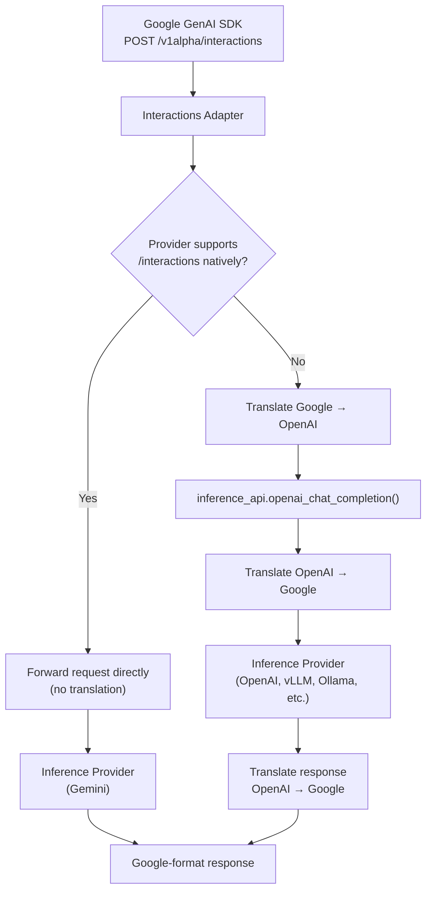

# Google Interactions API Compatibility

OGX provides a compatibility layer for the [Google Interactions API](https://ai.google.dev/gemini-api/docs/interactions) (v1alpha), so teams using the Google GenAI SDK can point at a OGX server with minimal code changes.

```python
from google import genai
from google.genai import types

client = genai.Client(
    api_key="no-key-required",
    http_options=types.HttpOptions(
        base_url="http://localhost:8321",
        api_version="v1alpha",
    ),
)

response = client.interactions.create(
    model="llama-3.3-70b",
    input="Hello",
)
print(response.outputs[0].text)
```

## Implemented endpoints

| Endpoint | Method | Status |
|----------|--------|--------|
| `/v1alpha/interactions` | POST | Implemented |
| `/v1alpha/interactions/{id}` | GET | Not yet |
| `/v1alpha/interactions/{id}` | DELETE | Not yet |
| `/v1alpha/interactions/{id}/cancel` | POST | Not yet |

For property-level coverage details, see the [conformance report](/docs/api-google-interactions/conformance).

## How it works

The Interactions adapter checks whether the configured inference provider natively supports the `/v1alpha/interactions` endpoint. If it does, the request is forwarded directly. Otherwise, the adapter translates between Google and OpenAI formats.



**Translation path** (most providers): the adapter converts the full request and response between formats:

- **Text generation** with string or multi-turn conversation input
- **Streaming** via Server-Sent Events matching Google's event format
- **System instructions** mapped to the system role
- **Generation config** parameters (temperature, top_p, top_k, max_output_tokens)
- **Tool calling** with function declarations, function_call outputs, and function_response inputs

**Passthrough path** (Gemini): when using the Gemini inference provider, requests are forwarded directly to Google's API without translation, including raw SSE streaming.

## Using with Google ADK

The [Google Agent Development Kit (ADK)](https://google.github.io/adk-docs/) can use the Interactions API as its inference backend when `use_interactions_api=True` is set on the `Gemini` model. However, ADK's `Gemini` class currently creates its own `google.genai.Client` internally and does not allow injecting a pre-configured client with a custom `base_url`.

This means you cannot point ADK at an OGX server out of the box. There is an [open PR](https://github.com/google/adk-python/pull/5035) to add a `client` parameter to the `Gemini` class. Until it merges, using ADK with OGX requires either:

- Monkey-patching `Gemini.api_client` with a custom `genai.Client` pointed at the OGX server
- Implementing a custom `BaseLlm` subclass that uses `genai.Client(http_options={"base_url": "..."})` directly

The GenAI SDK itself works without issues - you can create a `genai.Client` with a custom `base_url` and call `client.interactions.create(...)` directly against OGX.

## Known limitations

- Only text content is supported; multimodal inputs (images, audio, video) are not yet implemented
- Conversation chaining via `previous_interaction_id` is not yet available
- Background execution is not available
- The GET, DELETE, and Cancel endpoints are not yet implemented
- Response modalities are accepted for compatibility but ignored
